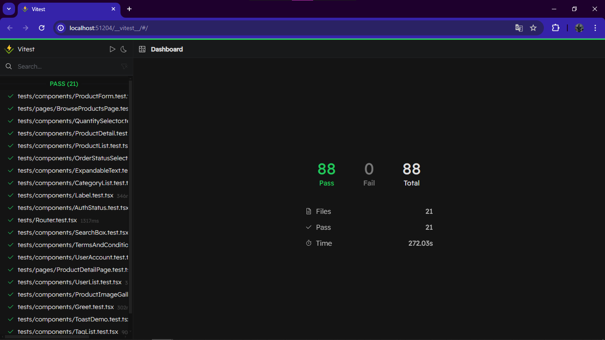

# Automated Testing for React Projects 🚀

Automated testing plays a crucial role in ensuring the quality and reliability of React projects. By automating tests, developers can catch bugs early, streamline workflows, and deliver high-quality code consistently. This README.md file provides an overview of the importance of automated testing, a comparison with other testing types, how it boosts testing for React apps, and the significance of Vitest framework and Testing Library and more.

## Outcomes of react testing 🔍

-> Master the fundamentals of testing React applications with React Testing Library.
-> Write maintainable, robust, and trustworthy tests that consistently deliver value.
-> Efficiently mock API responses with Mock Service Worker (MSW).
-> Mock data using @mswjs/data and @faker-js.
-> Simulate user events in a test environment.
-> Dive into advanced testing techniques involving authentication, state management, routing, etc.
-> Master refactoring techniques that pros use to make their code more readable and maintainable.
-> Learn from real-world examples and exercises that prepare you for the job.
-> Use ESLint to catch code quality issues early.

## Importance of Automated Testing 💡

Automated testing is essential for modern software development practices. It helps in:

- **Early Bug Detection:** Identifying and fixing bugs during development stages, reducing the cost of bug fixes in production.
- **Consistent Code Quality:** Ensuring that code meets quality standards across different iterations and team members.
- **Regression Testing:** Automating repetitive tests to check for regressions and ensure new changes don't break existing functionalities.



## Getting Started with react testing 👩🏻‍💻

Follow these steps to set up and run Automated Testing for React Projects on your local machine:

1. **Clone the repository:**

   ```
   git clone https://github.com/tayyab-004/react-testing-full-stack.git
   ```

2. **Navigate to the project directory:**

   ```
   cd react-testing-full-stack
   ```

3. Create a .env.local File:

   In the root directory of the project, you'll find a sample .env file. Make a copy and save it as .env.local.
   Replace the Auth0 Domain and Client ID with the actual values you obtained from Auth0.

4. **Install dependencies:**

   ```
   npm install
   ```

6. **Start the development server:**

   ```
   npm start
   ```

7. **To run tests:**

   For automated tests using Jest:

   ```
   npm run test:ui
   ```

Happy coding! ☕